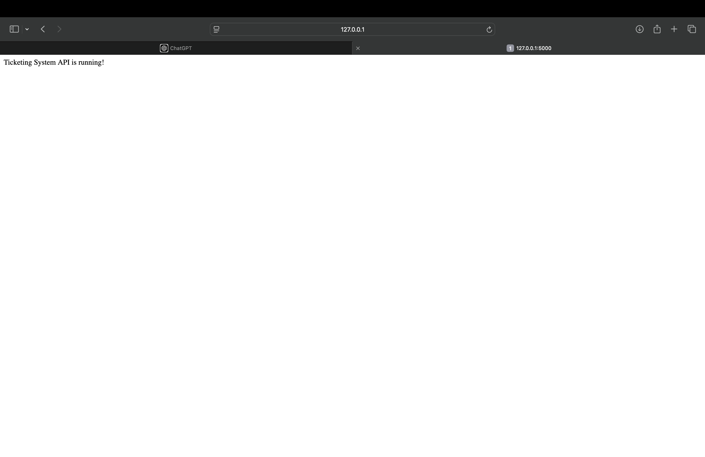
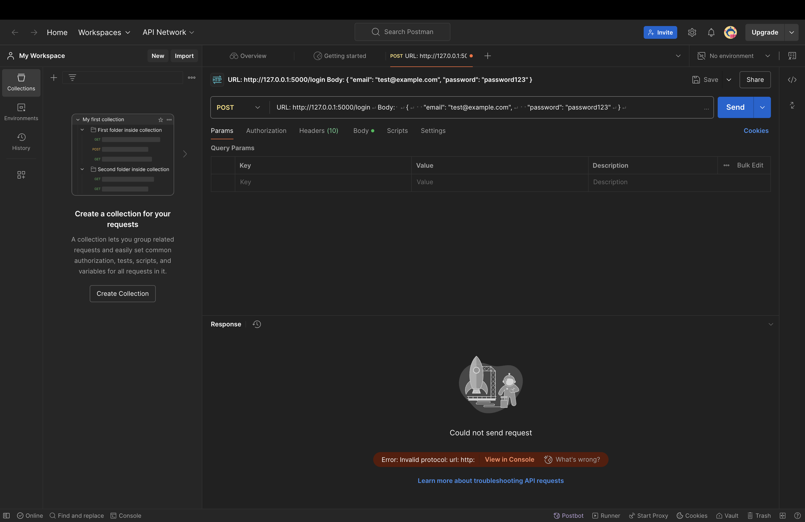
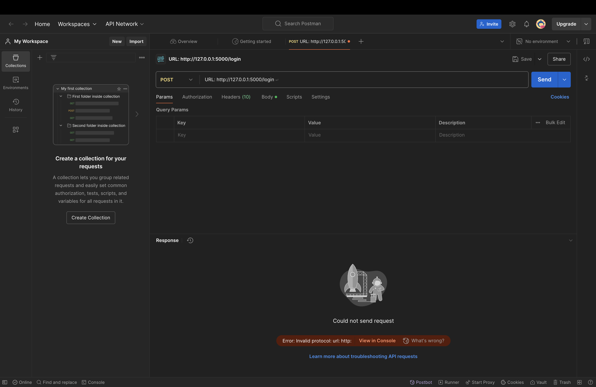

# Ticketing System

This is a simple ticketing system for managing and tracking tickets. The system is built using Python, HTML, and SQL. It is designed to provide an easy-to-use interface for submitting, managing, and resolving support tickets.

## Folder Structure

The project has been restructured into the following folders:

- **ticketing-system-repo/**: The root directory containing the main files and subfolders.
  - **backend/**: Contains the server-side logic and application files.
    - `app.py`: Main application logic.
    - `requirements.txt`: Python dependencies required for the project.
    - `placeholder.txt`: Placeholder file for structure.
  - **db/**: Contains database-related files.
    - `tickets.db`: SQLite database for storing tickets.
    - `placeholder.txt`: Placeholder file.
  - **docs/**: Documentation for the project.
    - `placeholder.txt`: Placeholder file for future documentation.
  - **frontend/**: Contains the front-end files.
    - `index.html`: Main user interface for submitting and viewing tickets.
    - `login.html`: Login page for authenticated access.
    - `style.css`: Stylesheet for the frontend.
    - `placeholder.txt`: Placeholder file for frontend structure.
  - **misc/**: Miscellaneous assets such as screenshots.
  - **schema.sql**: SQL schema for setting up the database.

## Installation

To get started with the ticketing system, follow the steps below:

1. **Clone the repository**:
   ```bash
   git clone https://github.com/c-razo/ticketing-system.git
   cd ticketing-system
   ```

2. **Set up the backend**:
   - Install the necessary Python packages:
     ```bash
     pip install -r backend/requirements.txt
     ```

3. **Set up the database**:
   - Use `schema.sql` to create the required database structure.
   - The database file `tickets.db` will be created in the `db/` directory.

4. **Run the application**:
   - Start the server by running the following command in the `backend/` directory:
     ```bash
     python backend/app.py
     ```

5. **Access the frontend**:
   - Open `frontend/index.html` in your browser to interact with the ticketing system.

## Usage

1. **Submit a Ticket**:
   - Go to the `index.html` page and fill in the necessary details to submit a ticket.

2. **Login**:
   - Use the `login.html` page for authenticated access to manage tickets.

3. **Manage Tickets**:
   - Tickets can be viewed and managed through the user interface.

## Contributing

Feel free to fork this project and submit pull requests. If you find any bugs or issues, please create a new issue in the GitHub repository.

## License

This project is licensed under the MIT License - see the [LICENSE](LICENSE) file for details.

## Screenshots

Some screenshots of the ticketing system:




